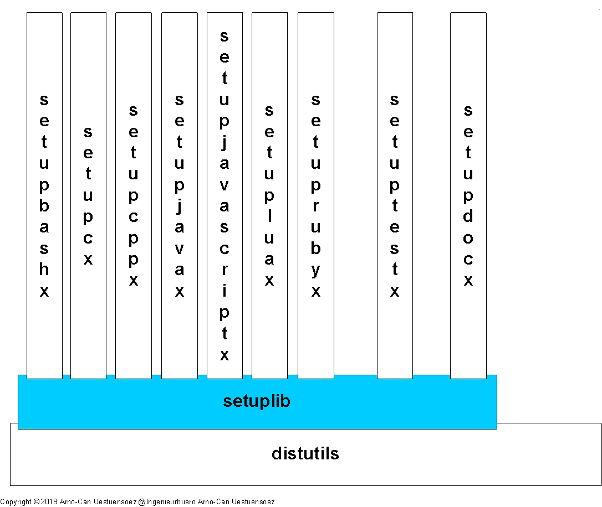
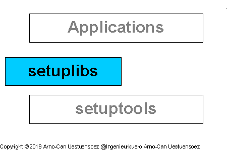

Abstract
========

Modern landscapes of information infrastructures are commonly designed 
and organized as stacks of runtime service environments.
The technical architecture of the service stacks consists of a wide range of
heterogenous landscapes of components frequently requiring adaptation and mediation
with extended special installations by *setuptools* / *distutils* via *setup.py*.

.. _FIGURE_ABSTRACT:

   
   Figure: Installation of Service Layers |figuresystemabstractprint_zoom| :ref:`more... <REFERENCE_ARCHITECTURE>`

.. |figuresystemabstractprint_zoom| image:: _static/zoom.png
   :alt: zoom 
   :target: _static/systems-ids.png
   :width: 16

The *setuplib* supports for example commands for the compilation and packaging of *Java* packages
required as *Jython* extensions for various *Java* based application servers.
*Jython* is supported for example  by
*JBoss Application Server*, *Oracle Weblogic Server*, and *IBM WebSphere Application Server*.
The provided extension commands comprise also the packaging of documents, which includes support
for *Sphinx* and *Epydoc*.
For more extensions refer to :ref:`Setuplib Commands <SETUPLIB_COMMANDS>`
and
':ref:`setuplib commands <SETUPLIBCLI>`'.
':ref:`setuplib extensions <SETUPLIBEXTENSIONS>`' 
and ':ref:`setuplib commands <SETUPLIBCLI>`'.

For tested standard OS and distributions see help on `installation <install.html>`_ / :ref:`Tested OS and Python Implementations <TESTED_OS_PYTHON>`.
These are supported as the platform for the creation of the Python distributions,
once the distribution package is created, *setuplib* is no longer required.
So for example on the runtime environments for IoT devices such as *MicroPython*.
   
Platform Support
================

The supported Python versions are:

* Core syntax: `Python2.7+, Python3.5+ <install.html#>`_ - see [pythonids]_
* Implementations: `CPython, PyPy, IPython, Jython, IronPython <install.html#>`_ - see [pythonids]_

The supported platforms are:

* `Linux, BSD, Unix/Solaris, OS-X, Cygwin, and Windows <install.html#>`_ - see [platformids]_
* `x86, amd64, arm32/armhf, arm64/aarch64 <install.html#>`_ - see [machineids]_

Supported/Verified devices - see [machineids]_:

* Notebooks, Workstations, and Server
* PMs and VMs - Hybrid Clouds and Container Stacks 
* Windows-WSL
* RaspberryPI, Asus-TinkerBoard

For a complete list of supported platforms refer to '`Prerequisites <install.html>`_', 
for current test status see ':ref:`Tested OS and Python Implementations <TESTED_OS_PYTHON>`'.

.. note::

   The current version is tested for:

   * package creation:
      On *Linux* / *Fedora*.
      Should work on any *Posix* including *macOS* / *OS-X* and *Cygwin*.
      May work on *Windows-NT* with *bash* or a custom scripts
      see :ref:`--build-apidoc= <setuplibCOMMANDS_build_apidoc>`,
      and :ref:`--build-sphinx= <setuplibCOMMANDS_build_sphinx>`.
      
   * installation target:
      Any supported OS, see section '`Install <install.html>`_'.   

Cockpit
=======

Command Line Interface
----------------------

   Command extensions for *setup.py* - see also overview of :ref:`Setuplib Commands <SETUPLIB_COMMANDS>`.

   .. raw:: html
   
      

      

      

   +--------------------------------------------------------------+----------------------------+
   | Command Line Interface                                       | Call Options               |
   +==============================================================+============================+
   | :ref:`setup.py \<setuplib-extensions> <SETUPLIBCLI>` | :ref:`setuplibCLISYNOPSIS` |
   +--------------------------------------------------------------+----------------------------+
   |                                                              | :ref:`setuplibCLIOPTIONS`  |
   +--------------------------------------------------------------+----------------------------+
   |                                                              | :ref:`setuplibEXAMPLES`    |
   +--------------------------------------------------------------+----------------------------+

   .. raw:: html
      
      

      

      

API
---
For the common extensions interface:

   .. parsed-literal::
   
      python  setup.py <command> [<cli-options>]
      ipython setup.py <command> [<cli-options>]
      ipw.exe setup.py <command> [<cli-options>]
      jython  setup.py <command> [<cli-options>]
      pypy    setup.py <command> [<cli-options>]

refer to:

   .. raw:: html
   
      

      

      

   
   +------------------------------------------+--------------------------------------------------------------+------------------------------------------------+------------------------------------------------+----------------------------------------------------------------------------------------+
   | commands                                 | cli options                                                  | shortcuts                                      | module                                         | API                                                                                    |
   +==========================================+==============================================================+================================================+================================================+========================================================================================+
   | :ref:`build_docx <SETUP_BUILD_DOCX>`     | :ref:`setup.py build_docx <setuplibCOMMANDS_build_docx>`     | :ref:`build_docx <SC_build_docx>`              | :ref:`build_docx <setuplibBUILDDOCX>`          | `setuplib.build_docx.BuildDocX <_modules/setuplib/build_docx.html#BuildDocX>`_         |
   +                                          +                                                              +                                                +                                                +                                                                                        +
   |                                          |                                                              | :ref:`create_sphinx.sh <SC_create_sphinx>`     | :ref:`call_apidoc.sh <CALL_APIDOC>`            | :ref:`call_apidoc.sh <CALL_APIDOC_SOURCE>`                                             |
   +                                          +                                                              +                                                +                                                +                                                                                        +
   |                                          |                                                              | :ref:`create_sphinx.sh <SC_create_sphinx>`     | :ref:`call_sphinx.sh <CALL_SPHINX>`            | :ref:`call_sphinx.sh <CALL_SPHINX_SOURCE>`                                             |
   +------------------------------------------+--------------------------------------------------------------+------------------------------------------------+------------------------------------------------+----------------------------------------------------------------------------------------+
   | :ref:`build_jy <SETUP_BUILD_JY>`         | :ref:`setup.py build_jy <setuplibCOMMANDS_build_jy>`         | :ref:`setup.py build_java <SC_build_java>`     | :ref:`build_java <setuplibBUILDJAVA>`          | `setuplib.build_java.BuildJava <_modules/setuplib/build_java.html#BuildJava>`_         |
   +------------------------------------------+--------------------------------------------------------------+------------------------------------------------+------------------------------------------------+----------------------------------------------------------------------------------------+
   | :ref:`build_java <SETUP_BUILD_JAVA>`     | :ref:`setup.py build_java <setuplibCOMMANDS_build_java>`     | :ref:`setup.py build_jy <SC_build_jy>`         | :ref:`build_jy <setuplibBUILDJY>`              | `setuplib.build_jy.BuildJy <_modules/setuplib/build_jy.html#BuildJy>`_                 |
   +------------------------------------------+--------------------------------------------------------------+------------------------------------------------+------------------------------------------------+----------------------------------------------------------------------------------------+
   | :ref:`dist_docx <SETUP_DIST_DOCX>`       | :ref:`setup.py dist_docx <setuplibCOMMANDS_dist_docx>`       | :ref:`setup.py dist_docx <SC_dist_docx>`       | :ref:`dist_docx <setuplibDISTDOCX>`            | `setuplib.dist_docx.DistDocX <_modules/setuplib/dist_docx.html#DistDocX>`_             |
   +------------------------------------------+--------------------------------------------------------------+------------------------------------------------+------------------------------------------------+----------------------------------------------------------------------------------------+
   | :ref:`install_docx <SETUP_INSTALL_DOCX>` | :ref:`setup.py install_docx <setuplibCOMMANDS_install_docx>` | :ref:`setup.py install_docx <SC_install_docx>` | :ref:`install_docx <setuplibINSTALLDOCX>`      | `setuplib.install_docx.InstallDocX <_modules/setuplib/install_docx.html#InstallDocX>`_ |
   +------------------------------------------+--------------------------------------------------------------+------------------------------------------------+------------------------------------------------+----------------------------------------------------------------------------------------+
   | :ref:`testx <SETUP_TESTX>`               | :ref:`setup.py testx <setuplibCOMMANDS_testx>`               | :ref:`setup.py testx <SC_testx>`               | :ref:`testx <setuplibTESTX>`                   | `setuplib.testx.TestX <_modules/setuplib/testx.html#TestX>`_                           |
   +------------------------------------------+--------------------------------------------------------------+------------------------------------------------+------------------------------------------------+----------------------------------------------------------------------------------------+
      
   .. raw:: html
      
      

      

      

Documents
---------

   .. raw:: html
   
      

      

      

   +------------------------+-------------------------------+
   | Artifacts              | Shortcuts                     |
   +========================+===============================+
   | Setuplib Commands      | :ref:`SETUPLIB_COMMANDS`      |
   +------------------------+-------------------------------+
   | Concepts and Design    | :ref:`DEVELOPMENTDOCS`        |
   +------------------------+-------------------------------+
   | Programming Interfaces | :ref:`setuplib <SC_setuplib>` |
   +------------------------+-------------------------------+

   .. raw:: html
   
      

      

      

.. _setuplib: package_init.html#
.. _setuplib.__init__: _modules/setuplib/__init__.html#

.. _platforms: platforms.html#
.. _setuplib.platforms: _modules/setuplib/platforms.html#

.. _POSIX, CIFS, URI...: package_doc.html#resources

.. _HowTo Custom Data:  howto_custom.html

.. _setuplib.config: config.html

.. _config data: config_data.html

.. _dist.custom.circuitpython: dist/custom/circuitpython.html#
.. _dist.custom.micropython: dist/custom/micropython.html#

Blueprint
=========

.. _REFERENCE_ARCHITECTURE:

The modern landscapes of information infrastructures are commonly designed 
and organized as stacks of heterogeneous runtime environments
with comon frameworks.
This frequently requires the installation of specific components for various
platforms, including the generation of adapted packages, extended documentation,
and the automation of distributed large-scale tests.
The *setuplibs* extends the *setuptools* for the required commands and options.

.. _FIGURE_ARCHITECTURE:

   
   Figure: Setuplib Integration |setuplibarchitecture_zoom|

.. |setuplibarchitecture_zoom| image:: _static/zoom.png
   :alt: zoom 
   :target: _static/setuplib-architecture.png
   :width: 16

The current provided extensions are:

* *Java* packaging:

   .. parsed-literal::
   
      python :ref:`setup.py <SETUPPYSRC>` :ref:`build_jy <SETUP_BUILD_JY>`          # for Jython - by setuplib, extends build_py
      python :ref:`setup.py <SETUPPYSRC>` :ref:`build_java <SETUP_BUILD_JAVA>`        # for Java   - by setuplib, introduces Java modules

* Document creation, packaging, distribution, and installation with *sphinx* and *epdydoc* integration: 

   .. parsed-literal::
   
      python :ref:`setup.py <SETUPPYSRC>` :ref:`build_docx <SETUP_BUILD_DOCX>`        # compiles documents
      python :ref:`setup.py <SETUPPYSRC>` :ref:`dist_docx <SETUP_DIST_DOCX>`         # creates document distribution packages
      python :ref:`setup.py <SETUPPYSRC>` :ref:`install_docx <SETUP_INSTALL_DOCX>`      # installs local from build directory

* Test automation for the unittest of multiple combined source packages:

   .. parsed-literal::
   
      python :ref:`setup.py <SETUPPYSRC>` :ref:`testx <SETUP_TESTX>`             # supports the major implementations:
                                        #    *CPython*, *IPython*, *IronPython*, *Jython*, *PyPY* 

Table of Contents
=================
   
.. toctree::
   :maxdepth: 1

   shortcuts

   setuplib_cli
   setuptools_commands
   setup_platforms_build_target
   setup
   
   howto
   install

   sw_design
   references

Indices and tables
==================

* :ref:`genindex`
* :ref:`modindex`
* `References <references.html>`_
* :ref:`search`

Resources
=========

.. include:: project.rst

**Home**

* Sourceforge.net: https://sourceforge.net/projects/setuplib/

**Online Documents**

* Sourceforge.net: https://setuplib.sourceforge.io/

**Licenses**

* Artistic-License-2.0(base license): `ArtisticLicense20.html <_static/ArtisticLicense20.html>`_

* Forced-Fairplay-Constraints(amendments): `licenses-amendments.txt <_static/licenses-amendments.txt>`_ 

  |profileinfo|  [xkcd]_ Support the OpenSource Authors |smilecool|

  .. |profileinfo| image:: _static/profile_info.png 
     :target: _static/profile_info.html
     :width: 48

**Runtime Repository**

* Python Package Index: https://pypi.org/project/setuplib/

**Downloads**

* bitbucket.org: https://bitbucket.org/acue/setuplib/

* github.com: https://github.com/ArnoCan/setuplib/

* Python Package Index: https://pypi.org/project/setuplib/

* Sourceforge.net: https://sourceforge.net/projects/setuplib/

.. |smilecool| image:: _static/smiling-face-with-sunglasses-32x32.png
   :width: 16
   :alt: :-)
